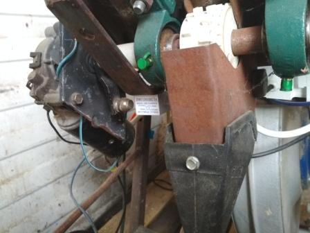

# siewnik

Pneumatyczny siewnik warzyw z bieżącym obliczaniem dawki wysiewu, wagą nasion i aplikacją sterującą Android

## 

Siewnik o szerokości roboczej 2,7m wysiewa nasiona w ośmiu dwu-rzędowych pasach, umożliwia wysiew nasion lekkich (pietruszka, marchew) jak i cięższych (burak ćwikłowy) w dawkach od kilkuset gram do kilkudziesięciu kilogramów na hektar.  Ciężar nasion w zbiorniku jest obliczany za pomocą belki tensometrycznej. Prędkość poruszania się obliczana jest na podstawie zmian stanu czujnika indukcyjnego położonego przy kole kopiującym. Dawka chwilowa siewu jest obliczana na podstawie  dawki zadanej i prędkości siewnika. Osiągana jest poprzez dobranie na podstawie danych z próby kręconej prędkości obrotu silnika 12VDC napędzającego wałek wygarniający nasiona ze zbiornika. Nasiona są następnie wprowadzone do zbiorczego przewodu powietrza. Przepływ powietrza zapewnia dwustopniowy wentylator. Strumień powietrza wraz z niesionymi nasionami jest rozdzielany w głowicy rozdzielającej na 16 kanałów i przewodami prowadzi nasiona do talerzowych redlic wysiewających. Głębokość wysiewu zapewniają koła kopiujące redlic.  Waga nasion pozostałych w zbiorniku nasion, prędkości siewnika, dawka wysiewu na hektar, prędkości obrotowe wałków wygarniającego, i wprowadzającego wyświetlane są na urządzeniu mobilnym operatora.  Siewnik zagregowany z formownicą redlin wysiewa marchew na dwóch podwyższonych zagonach, wymaga ciągnika o mocy 60KM.

Na zdjęciu od lewej: silnik napędzający wałek poprzez sprzęgło, osadzone na wałku kółko wygarniające (wysiewające).

